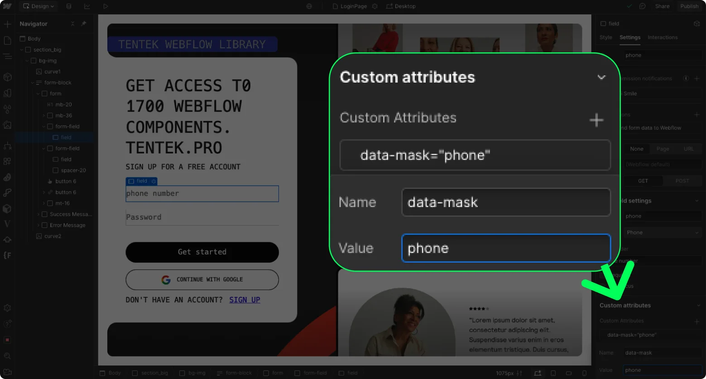

# Phone Masks for Webflow

Light JavaScript library for phone number masking in Webflow projects. Supports international number formats with automatic country code detection.

## Features

- 🌍 International formats support
- 🔍 Automatic country code detection
- ⚡ Lightweight with no dependencies
- 🎯 Optimized for Webflow

## Installation

1. Add the script to your Webflow project's Head Code section:

```html
<script src="https://cdn.jsdelivr.net/gh/Medeshov/phone-mask-for-webflow@main/kai-phone-mask.js"></script>
```

2. Add the `data-mask="phone"` attribute to your phone input field:

   1. Select your phone input field
   2. Open the Settings panel
   3. Click on "Custom Attributes"
   4. Add a new attribute:
      - Name: `data-mask`
      - Value: `phone`



---

# Маски телефонов для Webflow

Легкая JavaScript библиотека для маскирования телефонных номеров в Webflow проектах. Поддерживает международные форматы номеров с автоматическим определением кода страны.

## Особенности

- 🌍 Поддержка международных форматов
- 🔍 Автоматическое определение кода страны
- ⚡ Легкий вес и никаких зависимостей
- 🎯 Оптимизирован для Webflow

## Установка

1. Добавьте скрипт в секцию Head Code вашего Webflow проекта:

```html
<script src="https://cdn.jsdelivr.net/gh/Medeshov/phone-mask-for-webflow@main/kai-phone-mask.js"></script>
```

2. Добавьте атрибут `data-mask="phone"` к полю ввода телефона:

   1. Выберите поле ввода телефона
   2. Откройте панель настроек
   3. Нажмите на "Custom Attributes"
   4. Добавьте новый атрибут:
      - Имя: `data-mask`
      - Значение: `phone`

